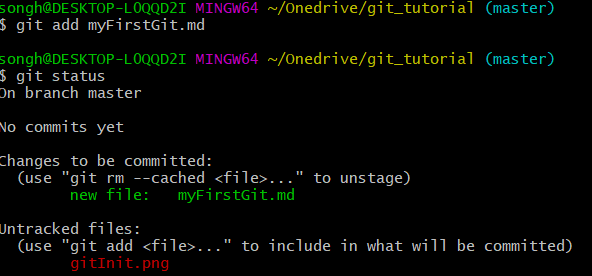
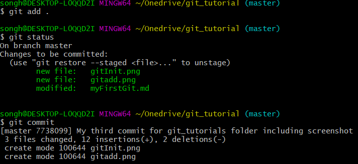
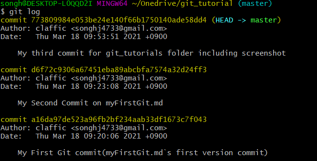
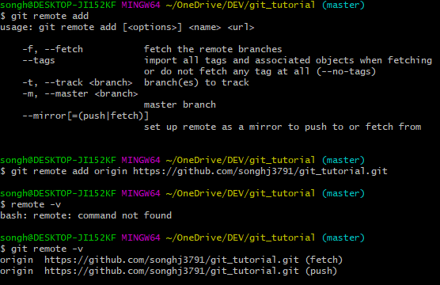
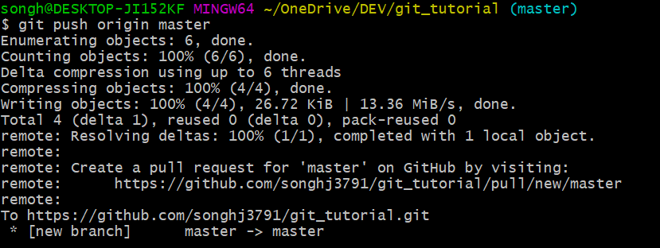

# Git

> ## Git = Version Control System  
> Git could make us to corporate each other by network.  
> This means that we also could contorl our code by version by version.

## git init

```bash
# View git Command
$ git

# Make master branch in your current folder
# After initialize your git master branch your could see .git file on your master branch folder 
$ git init
$ ls -al

```


---
## git add

```bash
# You could add your new or revised file to git
$ git add [file name]

$ git status
```


As you can see there is new file on git server which is myFirstGit.md

---
## git commit  

```bash
# After revised your code, it needs to be commited to make it confirmed.
$ git commit

# You can also make comment to refer the updated version
# You can see your updated history by git log command
$ git log
```



<br>
<br>
<br>

  
# Github
>Now we are trying to upload our code to Github repository.


<br>
<br>


## git remote add
>After you create your own repository on github, you can create remote link to created repository(url) by using git remote command

```bash
# git remote command
usage: git remote [-v | --verbose]
   or: git remote add [-t <branch>] [-m <master>] [-f] [--tags | --no-tags] [--mirror=<fetch|push>] <name> <url>
   or: git remote rename <old> <new>
   or: git remote remove <name>
   or: git remote set-head <name> (-a | --auto | -d | --delete | <branch>)
   or: git remote [-v | --verbose] show [-n] <name>
   or: git remote prune [-n | --dry-run] <name>
   or: git remote [-v | --verbose] update [-p | --prune] [(<group> | <remote>)...]
   or: git remote set-branches [--add] <name> <branch>...
   or: git remote get-url [--push] [--all] <name>
   or: git remote set-url [--push] <name> <newurl> [<oldurl>]
   or: git remote set-url --add <name> <newurl>
   or: git remote set-url --delete <name> <url>


# git remote add [<option>] <name> <url>
# name means that what you called the link
# url means that the exact location to upload your code
# options
 -f, --fetch           fetch the remote branches
    --tags                import all tags and associated objects when fetching
                          or do not fetch any tag at all (--no-tags)
    -t, --track <branch>  branch(es) to track
    -m, --master <branch>
                          master branch
    --mirror[=(push|fetch)]
                          set up remote as a mirror to push to or fetch from

# Add remote link called origin has address which is  https://github.com/songhj3791/git_tutorial.git
$ git remote add origin https://github.com/songhj3791/git_tutorial.git

# Command to check remote link`s name and url
$ git remote -v
```
<br>


<br>
<br>
<br>

## git push
>After creating remote link, you can push your code to github server by using git remote command.

```bash
# push your current branch file to remote link
$ git push <branch> <remote link>
```



Now you could see your push request in your repository


